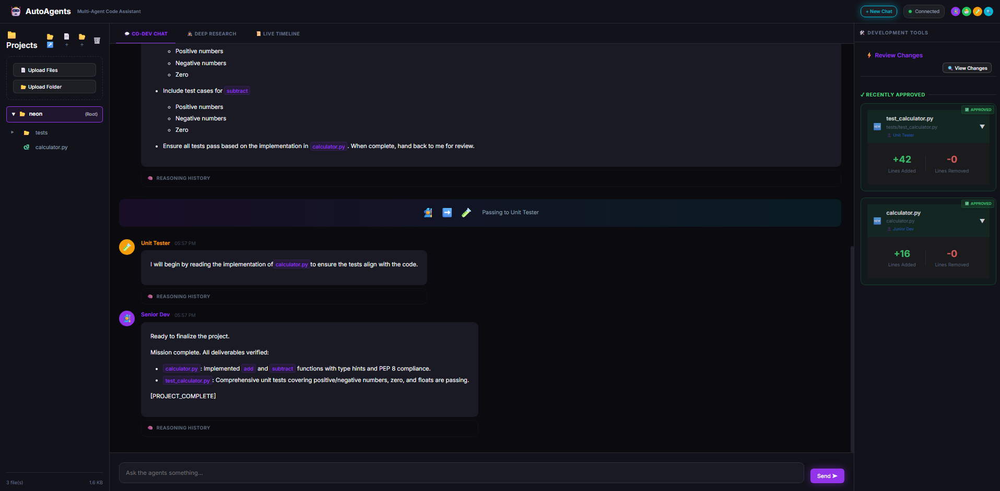
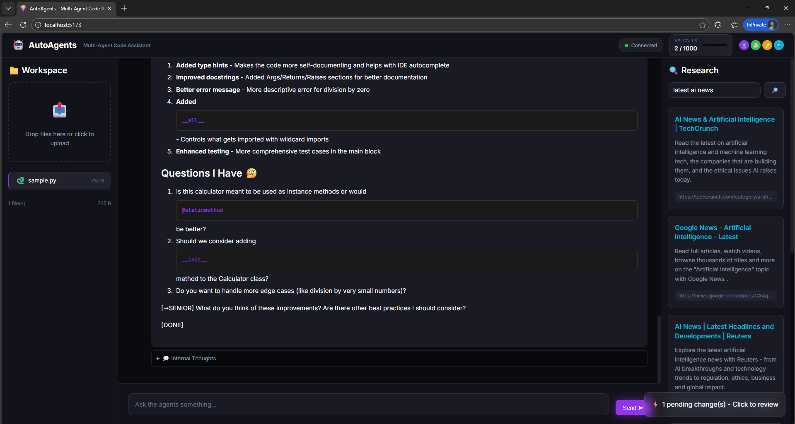

# 🤖 Multi-Agent Code Assistant

A fun, interactive web application where AI agents (DeepSeek & Gemini) collaborate as a development team to review, improve, and test your code!

### 📸 Screenshots

<div align="center">
  
  <br><i>Main chat interface with real-time streaming and neon theme</i>
  <br><br>
  
  <br><i>Tandem agents performing parallel search and synthesis</i>
  <br><br>
  
  <br><i>Advanced workspace management and Safe Switch project switching</i>
</div>

## ✨ Features

- **🧙 Senior Dev** (Gemini) - Architecture, best practices, code review
- **🐣 Junior Dev** (DeepSeek) - Implementation, questions, learning  
- **🧪 Unit Tester** (Gemini) - Test coverage, edge cases, quality
- **🔍 Researcher** (DeepSeek) - Web searches, documentation, latest news

#### 🔬 Dedicated Deep Research
The Research framework uses a **Tandem Architecture** for maximum depth and speed:
1.  **Lead Architect (Gemini 3 Flash)**: Orchestrates the mission, performs high-speed web searches, and scrapes multiple sources in parallel.
2.  **Synthesis Engine (DeepSeek V3)**: Analyzes the gathered raw data and synthesizes it into a high-impact Executive Report.

### Highlights
- 🎬 **Real-time streaming** - Watch agents think and respond live
- 💭 **Thought bubbles** - See agent reasoning (collapsible)
- ✏️ **File management** - Agents can create, edit, or delete files with your approval
- ⚡ **Safe Switch Management** - Dynamically switch between project folders without data loss
- 🌈 **Color-coded Diffs** - Visual representation of code additions and removals
- 🔍 **Context-Aware Sidebar** - Rename, move, and organize files with a sleek tree view
- 🌐 **Web research** - Agents browse docs, Stack Overflow, GitHub
- 🎨 **Neon dark theme** - Beautiful UI with fun animations
- 📊 **Usage tracking** - Monitor API usage and costs

---

## 🚀 Quick Start

### Prerequisites
- Python 3.11+
- Node.js 18+
- API Keys for [Gemini](https://aistudio.google.com/) and [DeepSeek](https://platform.deepseek.com/)

### 1. Clone & Setup

```bash
cd DevSquad-AI

# Copy environment file and add your API keys
cp .env.example .env
# Edit .env and add your GEMINI_API_KEY and DEEPSEEK_API_KEY
```

### 2. Backend Setup

```bash
cd backend

# Create virtual environment
python -m venv venv

# Activate (Windows)
.\venv\Scripts\activate

# Activate (Mac/Linux)
source venv/bin/activate

# Install dependencies
pip install -r requirements.txt

# Install Playwright browsers (for web research)
playwright install chromium

# Start the server (Hypercorn recommended for Windows/Playwright stability)
hypercorn main:app --bind 0.0.0.0:8000 --reload
```

---


### 3. Frontend Setup

```bash
cd frontend

# Install dependencies
npm install

# Start dev server
npm run dev
```

### 4. Open the App

Visit **http://localhost:5173** 🎉

---

## 📁 Project Structure

```
DevSquad-AI/
├── backend/
│   ├── main.py              # FastAPI server
│   ├── agents/              # AI agent personas
│   │   ├── orchestrator.py  # Manages conversations
│   │   ├── senior_dev.py    # Gemini senior dev
│   │   ├── junior_dev.py    # DeepSeek junior dev
│   │   ├── unit_tester.py   # Gemini tester
│   │   └── researcher.py    # DeepSeek researcher
│   ├── prompts/             # Fine-tuned system prompts
│   ├── services/            # File manager, browser, etc.
│   └── requirements.txt
├── frontend/
│   ├── src/
│   │   ├── App.jsx          # Main layout
│   │   ├── components/      # React components
│   │   └── index.css        # Neon theme
│   └── package.json
├── projects/                # Your dynamically managed project folders
├── .env                     # Your API keys
└── README.md
```

---

## 🎮 How It Works

### 🧠 System Logic
The application is designed around a **State Machine pattern** where each AI agent acts as a specialized node in a collaborative workflow. 

- **Autonomous Decision Making**: Agents (Senior, Junior, Tester, etc.) don't just answer questions; they decide who is best suited to handle the next part of your request.
- **The Orchestrator**: The central `orchestrator.py` manages the "handoff" logic. It parses agent responses for specific [cues](#agent-cue-system) and automatically routes the conversation to the next expert, ensuring a seamless multi-agent collaboration.

### Agent Cue System
Agents communicate via special cues in their responses:

| Cue | Action |
|-----|--------|
| `[→SENIOR]` | Pass conversation to Senior Dev |
| `[→JUNIOR]` | Pass to Junior Dev |
| `[→TESTER]` | Pass to Unit Tester |
| `[→RESEARCH]` | Request web research |
| `[SEARCH: "query"]` | Perform targeted web search (Researcher only) |
| `[FILE_SEARCH:pattern]` | Search for files in the active project |
| `[READ_FILE:path]` | Read file content in background (stays out of chat) |
| `[EDIT_FILE:path]` | Propose file edit (requires approval) |
| `[CREATE_FILE:path]` | Create a new file (requires approval) |
| `[DELETE_FILE:path]` | Propose file deletion (requires approval) |
| `[DONE]` | Mission accomplished |

### File Safety
- ✅ Create new files
- ✅ Edit existing files
- ✅ Delete files (requires explicit approval)
- 🔒 All changes require user approval
- 📁 **Dynamic Sandboxing** - Prevents access outside the active project folder
- 🧹 **Intelligent Scrubbing** - Raw technical tags and oversized code blocks are moved to the Review Panel for readability

---

## ⚙️ Configuration

Edit `.env` to customize:

```env
# Required
GEMINI_API_KEY=your_key
DEEPSEEK_API_KEY=your_key

# Optional
MAX_FILE_SIZE_MB=10          # Max upload size
ENABLE_BROWSER_AGENT=true    # Enable web browsing
USAGE_LIMIT_PER_DAY=1000     # API call limit
```

---

## 🛠️ API Endpoints

| Endpoint | Method | Description |
|----------|--------|-------------|
| `/upload` | POST | Upload files/folders to project |
| `/chat` | POST | Send message to agents |
| `/ws/agents` | WebSocket | Real-time agent stream |
| `/files` | GET | List active project files |
| `/create-folder`| POST | Create a new directory |
| `/move` | POST | Move files/folders (Drag & Drop) |
| `/rename` | POST | Rename files/folders inline |
| `/select-folder`| GET | Open native folder picker |
| `/set-workspace`| POST | Switch active project |
| `/approve` | POST | Approve/Reject file changes |
| `/research` | POST | Web research query |
| `/usage` | GET | API usage stats |

---

## 🔮 Roadmap

### Phase 2: AWS Deployment
- [ ] S3 for file storage
- [ ] Lambda for agent execution
- [ ] DynamoDB for session history
- [ ] CloudFront CDN

### Future Ideas
- [ ] More agent personas (DevOps, Security, etc.)
- [ ] Git integration
- [ ] Voice chat with agents
- [ ] VS Code extension

---

## 📝 License

MIT License - feel free to use and modify!

---

## 🙏 Acknowledgments

- [Google Gemini](https://deepmind.google/technologies/gemini/) - AI backbone
- [DeepSeek](https://www.deepseek.com/) - AI backbone  
- [Playwright](https://playwright.dev/) - Browser automation
- [FastAPI](https://fastapi.tiangolo.com/) - Backend framework
- [React](https://react.dev/) - Frontend framework

---

## 📞 Contact

[Andrew Ivory](https://www.linkedin.com/in/andrewivory1)


---
